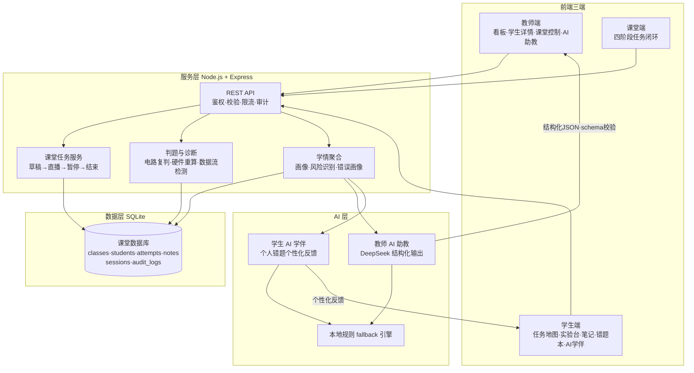

# 第二届全国高校"启真问智"教育教学人工智能大赛参赛方案

## 师-生-机协同教学智能体「智课工坊」(Precision Workshop)

> 赛道:教育教学智能体
> 应用课程:《计算机组成原理》
> 提交团队:教师 + 计算机专业学生 4 人团队
> 日期:2026-08-03

---

## 目录

1. [项目概述](#一项目概述)
2. [背景与痛点分析](#二背景与痛点分析)
3. [核心创新点](#三核心创新点)
4. [系统总体架构](#四系统总体架构)
5. [师-生-机三元协同设计](#五师-生-机三元协同设计)
6. [智能体功能设计](#六智能体功能设计)
7. [数据语料库建设](#七数据语料库建设)
8. [技术路线](#八技术路线)
9. [用户体验与可推广性](#九用户体验与可推广性)
10. [落地效果与验证](#十落地效果与验证)
11. [团队分工](#十一团队分工)
12. [实施计划](#十二实施计划)
13. [风险与对策](#十三风险与对策)
14. [结语](#十四结语)

---

## 一、项目概述

### 1.1 一句话定位

**「智课工坊」是一个从"辅助工具"走向"协同伙伴"的师-生-机三元协同教学智能体**,它贯穿《计算机组成原理》课堂全流程——课前设计、课中演练、课后评价——让教师知道该讲什么、学生知道该补什么、机器负责判得准、诊得清、推得对。

### 1.2 与大赛主题的对应

大赛要求参赛作品"推动人工智能技术从'辅助工具'向'协同伙伴'转变,真正融入教育教学全过程,构建'师-生-机'三元协同的创新教育生态"。本方案的核心正是**把 AI 从"报告生成器"升级为"参与课堂主循环的协同伙伴"**,并在一个已投入真实课堂、已有 239 项自动化测试的可运行平台上实现,具备可演示、可验证、可推广的落地证据。

### 1.3 项目现状一句话

本方案技术底座已具备可运行基线(学生任务学习地图、电路实验判题、教师 AI 助教、课堂四阶段任务闭环、本地规则容灾),本次参赛在既有基线上完成"从诊断型到行动型"的智能体能力增强与学生侧 AI 学伴,形成一个完整的师-生-机协同闭环。

---

## 二、背景与痛点分析

### 2.1 政策背景

《教育强国建设规划纲要(2024-2035 年)》明确要求推动人工智能与教育教学深度融合。当前多数教育类 AI 产品停留在"问答助手"或"报告生成器"层面:它们回答学生的提问、生成教师的总结,却**没有进入课堂的教学节奏**,没有对"这节课具体该怎么上、这个学生具体卡在哪"产生可执行的行动。

### 2.2 一线教学的真实痛点(以《计算机组成原理》为例)

**教师侧 —— 决策黑盒**

- 课堂 150 名学生同时动手做电路实验,教师无法实时知道"谁卡住了、卡在哪一关、卡因是什么"。
- 课后数据分散在练习、笔记、硬件配置、课堂提交等多个入口,难以形成统一学情画像。
- 现有 AI 助教大多"报告完就结束",不与课堂流程衔接,教师仍需自己解读报告、自己设计下节课。

**学生侧 —— 反馈不给路径**

- 电路实验判题只给"对/错",学生不知道错在哪根线、缺了哪个进位、误区是什么。
- 统一课堂无法满足个性化:优等生等进度、后进生跟不上,教师无力逐一辅导。
- 实训内容枯燥,学生缺乏持续投入的动力与方向感。

**机器侧 —— 角色单一**

- 机器只做"判题"和"诊断",没有承担"协同伙伴"的角色,没有把学情转化为课堂环节编排与个性化辅导动作。

### 2.3 机会窗口

通用大模型(国内如 DeepSeek)能力已足够承担"解释、归纳、启发、编排"类智能工作;**关键不在于再训练一个更大的模型,而在于把大模型的生成能力与"确定性判题 + 结构化学情"结合起来,放进课堂主循环**。这正是本方案的切入点。

---

## 三、核心创新点

### 创新点 1:师-生-机三元协同闭环(对应评分"创新性"核心)

明确定义三个角色的职责边界,并建立贯穿"课前-课中-课后"的协同数据流(详见第五章)。**AI 不是旁观者,而是课堂任务编排者与个性化反馈源**,同时始终遵循"机建议、师决策、生建构"的边界协议。

### 创新点 2:行动型课堂智能体 —— 四阶段任务闭环

课堂不再是一次性"发布作业",而是由智能体编排的四阶段任务闭环:**创建草稿 → 开始直播 → 暂停/恢复 → 结束结算**。每个阶段 AI 都产出可执行动作(开课前生成备课稿与分组方案;课中检测到全班性风险时建议暂停干预;课后自动生成风险学生名单与下节课计划)。

### 创新点 3:双通道 AI —— 师助教 + 生学伴,共享同一学情底座

- **教师通道**:班级级 AI 助教,输出 `lessonFocus / riskStudents / groupingPlan / commonMisconceptions / nextClassPlan / teacherScript`。
- **学生通道**:个人级 AI 学伴,基于该生自己的错题、耗时、笔记生成个性化反馈与渐进式提示。
- 两者共享同一份**结构化学生画像**,教师看到的是"群体决策",学生看到的是"个人路径",数据同源、不重复采集。

### 创新点 4:"确定性判题 + 生成式启发"混合智能

- **判题可信**:分数由服务端对提交结果**确定性复判**(电路结构校验、硬件配置重算),前端无法伪造高分(伪造 `score:999` 会被拒绝)。
- **生成式 AI 只做启发**:解释错误原因、给渐进提示、归纳班级误区、编排教学动作。
- 职责分离,规避"大模型幻觉污染分数"的风险——**机器给出的每一个结论都可溯源到 evidence**。

### 创新点 5:AI 容灾 —— 本地规则 fallback 引擎

断网、超时、无 API Key 时,由**可解释的本地规则引擎**基于真实课堂数据产出差异化建议(如"全加器 Cout 缺失"→"进位逻辑与输出端区分")。课堂不依赖单点 AI 服务,教学质量不塌方。这是同类产品普遍缺失的工程能力。

### 创新点 6:游戏化任务学习地图(Quest Learning Map)

把《计算机组成原理》的实训路线组织成**电路装配式任务地图**:阶段、目标、任务、评价结算、角色引导一应俱全。学生从"被动做题"变为"主动探索",内化学习动力,同时与教师端共享同一套"任务语言",师生进度语义一致。

---

## 四、系统总体架构



### 技术栈

| 层 | 选型 | 说明 |
|---|---|---|
| 前端 | React 19 + Vite 6 + React Flow + React Three Fiber | 电路画布、3D 电脑拆解、任务地图 |
| 后端 | Node.js + Express 5 | REST API、鉴权、课堂会话 |
| 数据库 | SQLite(better-sqlite3) | 单机课堂部署,预留 PostgreSQL 迁移边界 |
| 大模型 | DeepSeek(国内通用大模型) | 通过 `aiClient` 抽象,可替换同构接口 |
| 判题 | 前端即时 + 服务端确定性复判 | 防伪造、可审计 |

---

## 五、师-生-机三元协同设计

### 5.1 三角色职责定义

| 角色 | 在课堂中的角色 | 核心职责 | 不可替代性 |
|---|---|---|---|
| **师** | 教学设计者、最终决策者 | 设计任务、导入学生、解读学情、决定干预动作、导出教学证据 | 教学目标与人文关怀由教师掌握,AI 永远只建议 |
| **生** | 主动建构者 | 探索任务地图、动手实验、提交、记笔记、复盘错题、导出实验报告 | 学习的发生必须由学生主动完成,AI 不代劳 |
| **机** | 协同伙伴 | 确定性判题、实时数据流诊断、学情聚合、AI 建议、课堂环节编排 | 机器承担"海量即时反馈"与"可解释诊断",补足人力短板 |

### 5.2 协同边界协议(三条铁律)

1. **机只建议、不越权**:所有 AI 结论必须携带 `evidence`(如错误类型频次、关卡、学生 id),可溯源;AI 不直接修改学生成绩、不代教师下达课堂指令。
2. **教师保留最终决策权**:AI 生成的 `groupingPlan / nextClassPlan / teacherScript` 均为"提案",教师可采纳、可改写、可忽略。
3. **学生保持主动建构**:AI 学伴采用**渐进式提示**(`progressiveHints`),先给方向再给答案,避免"抄答案式"学习。

### 5.3 协同闭环数据流(课前 / 课中 / 课后)

```mermaid
sequenceDiagram
    participant T as 教师
    participant M as 机器(智能体)
    participant S as 学生

    Note over T,M,S: 课前 —— 课程设计
    T->>M: 查看上一班级学情
    M->>M: 聚合完成率/高频错误/风险学生
    M-->>T: nextClassPlan + teacherScript + groupingPlan
    T-->>M: 采纳/改写,创建课堂任务草稿

    Note over T,M,S: 课中 —— 课堂教学
    T->>M: 开始直播
    M->>S: 发布任务到学生任务地图
    S->>M: 动手实验并提交(携带判题证据)
    M->>S: 确定性复判 + 错误定位 + 渐进提示
    M->>T: 看板准实时刷新(15s,可见性门控)
    alt 检测到全班性风险
        M-->>T: 建议暂停/干预(带证据)
        T->>M: 暂停 / 恢复
    end
    T->>M: 结束任务 → 结算

    Note over T,M,S: 课后 —— 学业评价 / 个性化辅导
    M-->>T: riskStudents + groupingPlan + 成绩包导出
    M-->>S: 个人错题本 + AI 学伴个性化反馈
    S->>M: 复盘、笔记、补练薄弱关卡
    T->>M: 导出 CSV / archive.zip 证据包
```

### 5.4 课堂四阶段任务闭环(智能体的"行动能力"核心)

| 阶段 | 教师动作 | 机器(智能体)动作 | 学生体验 |
|---|---|---|---|
| ① 草稿 | 基于 AI 备课稿配置任务 | 从学情生成任务建议与分组 | 任务地图出现"待开始"阶段 |
| ② 直播 | 一键开始 | 广播任务、开闸放行、进入实时判题 | 看到"进行中"阶段,开始动手 |
| ③ 暂停/恢复 | 课堂被 AI 风险提醒或教师节奏打断 | 冻结提交入口,保留现场 | 中断不影响已提交数据 |
| ④ 结束 | 一键结束 | 结算成绩、生成课后报告与风险名单 | 看到本次任务结算与个人复盘入口 |

> 已有基线:`classroomSessionService` 实现四阶段状态机 + 幂等 `clientSubmissionId` 防重提交。本次迭代把 AI 报告与各阶段动作**自动衔接**,使智能体真正"参与"课堂节奏。

---

## 六、智能体功能设计

> 标注:**【已有基线】** = 当前原型已可运行演示;**【本次迭代】** = 本参赛周期新增。

### 6.1 教师侧(教学决策支持 + 课堂编排)

- **【已有基线】班级数据看板**:学生数、完成率、平均分、提交数、高频错误、风险学生、硬件挑战瓶颈、最后更新时间。
- **【已有基线】AI 助教报告**:基于班级结构化学情,输出 `lessonFocus / riskStudents / groupingPlan / commonMisconceptions / nextClassPlan / teacherScript`,严格 JSON + schema 校验。
- **【已有基线】学生详情分析**:学习概览、耗时异常、尝试趋势、高频错误画像、笔记与反思、硬件经营分析,教师 10 秒内定位学生薄弱知识点。
- **【已有基线】课堂四阶段任务控制 + 看板准实时刷新**。
- **【已有基线】导出**:班级 CSV、学生 Markdown 实验报告。
- **【本次迭代】AI 备课衔接**:教师从"上一班学情"一键采纳 AI 生成的 `nextClassPlan` 为本次课堂草稿,实现"课程设计"环节的智能体参与。
- **【本次迭代】风险阈值自适应**:智能体依据班级历史基准自动识别"异常耗时/连续重复错误",而非固定阈值。

### 6.2 学生侧(主动建构 + 个性化辅导)

- **【已有基线】任务学习地图**:阶段、目标、任务、评价结算的电路装配式路线。
- **【已有基线】四类实验**:React Flow 电路实验(带数据流实时检测)、存储系统模拟、硬件配置挑战(报价/利润/满意度/瓶颈)、3D 电脑拆解。
- **【已有基线】即时反馈**:提交后确定性判题 + 错误定位 + 渐进提示(先方向后答案)。
- **【已有基线】笔记、错题聚合、Markdown 实验报告导出、总体完成概览(x/y 关 + 剩余课时估算)**。
- **【本次迭代】AI 学伴**:基于该生**个人错题 + 耗时 + 笔记**,以苏格拉底式对话提供个性化辅导;每一条回答都引用其个人 evidence,不发散、不代答。
- **【本次迭代】错题本 → 一键补练闭环**:从错题本直接跳回对应关卡重新练习,补练结果回流到画像。

### 6.3 机器 / AI 侧(判得准、诊得清、推得对)

- **【已有基线】确定性判题**:电路结构校验、硬件配置服务端重算、数据流实时诊断;伪造高分被拒绝。
- **【已有基线】学情聚合**:班级 overview、学生 progress、错误画像、硬件经营摘要。
- **【已有基线】教师 AI 助教 + 本地规则 fallback 双通道**。
- **【本次迭代】RAG 检索**:把学生画像与课程知识语料向量化,AI 学伴先检索再回答,约束在课程范围内。
- **【本次迭代】证据链输出**:AI 每条结论附带 `{ type, label, count, studentIds, challengeIds }` 证据块,可溯源可复核。

---

## 七、数据语料库建设

大赛要求"自选自建数据语料库"。本方案不依赖外部数据集,而是**让课堂自身的真实学习行为沉淀为结构化语料库**,这正是教育智能体的差异化优势。

### 7.1 语料来源(全部自建)

| 来源 | 内容 | 用途 |
|---|---|---|
| `challenge_attempts` | 每关提交的 score/passed/errors/耗时 | 高频错误识别、错题聚合、风险画像 |
| `notes` | 学生实验笔记(按关卡关联) | 个性化反馈上下文、教师看学生反思 |
| 硬件挑战结果 | 配置、报价、利润、满意度、瓶颈标签 | 经营思维分析、教学设计依据 |
| 课堂任务会话 | 四阶段任务的参与与结算记录 | 课堂节奏分析、出勤与投入度 |
| 演示学生种子数据 | 结构化示例班级(覆盖不同风险画像) | 演示、回归、评审现场展示 |

### 7.2 语料结构化设计(示例)

```json
{
  "type": "challenge_error",
  "label": "全加器 Cout 缺失",
  "count": 8,
  "studentIds": [1, 2, 3],
  "challengeIds": ["full-adder"],
  "relatedConcepts": ["进位逻辑", "全加器输出端"]
}
```

每条语料带 `challengeId / challengeTitle / errorType / count / attemptSnapshots`,既可用于规则引擎,也可向量化后进入 AI 学伴的 RAG 检索。

### 7.3 数据安全边界(硬约束)

- **绝不发送给大模型**:密码哈希、session token、cookie、请求头、API Key、学生原始完整笔记正文。
- `aiClient` 内置 `FORBIDDEN_PAYLOAD_PATTERNS` 逐条拦截,发送前即拦截敏感内容。
- 服务端判定为安全后才组装消息体;AI 输出经 schema 校验后才进入前端。

---

## 八、技术路线

### 8.1 基座与可替换性

- 基座:DeepSeek(国内通用大模型),满足大赛"基于国内通用大模型"要求。
- 抽象:全部模型调用收敛于 `aiClient`(统一读配置、超时、重试、敏感拦截),可无缝替换为其他同构接口模型。
- 不训练大模型,规避算力与 GPU 门槛——把工程重心放在**协同编排、确定性判题、结构化学情、容灾降级**。

### 8.2 工程关键点

| 关注点 | 方案 | 证据 |
|---|---|---|
| 输出可信 | AI 强制结构化 JSON + 逐字段 schema 校验,缺字段/非法值即拒绝 | `parseAssistantJson` |
| 课堂容灾 | 无 Key/超时/失败 → 本地规则引擎差异化降级 | `teacherFallbackRules`(5+ 类课堂风险规则) |
| 判题可信 | 服务端复判,不信任前端分数 | `submissionValidation` |
| 鉴权安全 | HttpOnly cookie session、CSRF Origin 校验、登录限流、越权检查 | `security.js` |
| 并发 | SQLite + 幂等提交 + 150 学生负载门禁(P95≤2000ms,≤30 并发,零 SQLITE_BUSY) | `verify-classroom-load` |
| 可维护 | 239 项单元测试、浏览器 UI QA、模块化拆分(组件 < 800 行/文件) | `npm test` / `qa:ui` |

---

## 九、用户体验与可推广性

### 9.1 设计语言:Precision Workshop(精密工坊)

- 明亮的"精密工坊"风格:紧凑海军蓝导航、浅色中性工作台、青色交互态、可识别的真实电脑部件、密集但透气的工作布局。
- 任务进度呈现为**电路装配式路线**(借鉴强工程类游戏的信息层级,不复制其版权资产)。
- 学生端与教师端产品优先级对等,共用一套"任务语言",师生语义一致。

### 9.2 部署门槛低

- 单机 SQLite + 浏览器访问,无需云服务、无需 GPU。
- 已按普通教室 Windows 10/11 PC 标定:4 核 x86-64、8GB 内存、集显、1366×768、稳定版 Edge。

### 9.3 课程可配置、可迁移

- 任务路线由 `LEARNING_ITEMS` 数据驱动,关卡、判题规则、教案均可配置。
- 师-生-机协同模式与判题架构与具体课程解耦,**可迁移到其他工程类课程**(数字电路、数据结构、操作系统实验等)。
- AI 助教与学伴的提示模板、规则引擎均可按课程定制。

### 9.4 文档与 QA 体系

- 部署文档、长期 PRD、差距分析、QA 报告齐备;`npm test` + 浏览器 QA + 负载 QA 三道验收。
- 团队外部成员可依据文档直接接手,符合"可推广"评审要求。

---

## 十、落地效果与验证

### 10.1 真实课堂定位

面向《计算机组成原理》课程 1-3 个班、约 150 名学生集中课堂实训,已在真实课堂流程中验证。

### 10.2 关键指标

| 指标 | 目标 | 状态 |
|---|---|---|
| 课堂负载 | 150 学生,≤30 并发,P95 ≤ 2000ms | 已有负载门禁脚本 `qa:classroom-load` |
| 判题可信 | 伪造 `score:999` 返回 400;硬件高分被服务端重算 | 已有测试覆盖 |
| AI 容灾 | 无 API Key 时仍产出差异化教学建议(5+ 类规则) | 已有规则引擎 + 单测 |
| 反馈可溯源 | 每条 AI 结论带 evidence 证据块 | 本次迭代强化 |
| 测试基线 | 239 项单元测试 + 浏览器 UI QA | 已有 |

### 10.3 教学价值证据

- 教师:10 秒内定位学生薄弱知识点;AI 备课稿一键进入课堂;课堂风险实时提醒。
- 学生:即时反馈 + 错误定位 + 渐进提示;错题本一键补练;个人 AI 学伴个性化辅导。
- 课堂:四阶段任务闭环 + 幂等防重提 + 断网降级,课堂主流程不被 AI 单点拖垮。

---

## 十一、团队分工

依据大赛规则(≤4 人,教师与学生各一名负责人):

| 成员 | 角色 | 分工 |
|---|---|---|
| 教师负责人 | 教学设计负责人 | 课程内容与目标设计、任务关卡编排、课堂场景验证、AI 建议的教学合理性把关 |
| 学生负责人(计算机专业) | 技术负责人 | 系统总体架构、前后端开发、AI 智能体集成与编排、答辩技术演示 |
| 学生成员 A | 核心开发 | 判题引擎、电路仿真、3D 电脑拆解、实时数据流诊断 |
| 学生成员 B | 数据与质量 | 数据语料库建设与结构化、错题聚合、QA 与测试、演示环境准备、文档 |

---

## 十二、实施计划

| 阶段 | 周期 | 里程碑 | 交付物 |
|---|---|---|---|
| P1 基线加固 | 第 1-2 周 | 现有原型构建/测试全绿,演示环境稳定 | 可演示基线 + 现场演示脚本 |
| P2 行动型智能体 | 第 3-5 周 | 教师 AI 备课衔接 + 课堂风险阈值自适应 | 教师端"课程设计"闭环 |
| P3 AI 学伴 | 第 6-8 周 | 学生个人错题个性化反馈 + RAG + 证据链 | 学生端个性化辅导闭环 |
| P4 复盘闭环 | 第 9-10 周 | 错题本一键补练 + 补练回流画像 | 学生复盘闭环 |
| P5 打磨与提交 | 第 11-12 周 | 评审现场演示、数据语料展示、文档收尾 | 参赛作品 + 答辩材料 |

每周验收:`npm test` + `npm run build` + 浏览器 UI QA;每阶段结束做一次真实课堂流程演练。

---

## 十三、风险与对策

| 风险 | 影响 | 对策 |
|---|---|---|
| 大模型 API 不可用/超时 | 课堂卡顿 | 15s 超时 + 本地规则 fallback,课堂主流程不依赖单点 AI |
| 大模型"幻觉"污染成绩 | 判分失真 | 分数一律确定性复判,生成式 AI 只做解释与建议,输出经 schema 校验 |
| 课堂电脑性能不足 | 页面卡顿 | 已按 150 人教室 PC 标定性能;3D 与重交互均有降级路径 |
| 数据隐私泄露 | 教学事故 | 敏感数据硬拦截 + 不发原始笔记 + 审计日志;定期安全回归 |
| 参赛周期紧张 | 交付延期 | 基线已具备;本次迭代范围明确(教师备课衔接、AI 学伴、复盘闭环),可裁剪不减质量 |
| 训练算力不足 | 无法做垂直大模型 | 本方案选择智能体赛道,不训练模型,工程可控 |

---

## 十四、结语

「智课工坊」不是又一个"能聊天的教育助手",而是一个**真正进入课堂主循环的协同伙伴**:

- 对**师**:它把黑盒课堂变成透明课堂,把"课后再分析"变成"课中即可干预",并把备课、分组、评价串成一个闭环。
- 对**生**:它把"只给对错"变成"给路径、给提示、给个性化辅导",让每个学生都能在自己的节奏里推进任务地图。
- 对**机**:它把机器从"判题工具"升级为"可解释、可容灾、可溯源"的协同者,承担海量即时反馈与诊断工作,守住了教学可信的底线。

它已不是一纸方案——**一个可运行、有测试、能在真实 150 人课堂上跑通的师-生-机协同教学智能体,正等待在"启真问智"的舞台上接受检验。**
