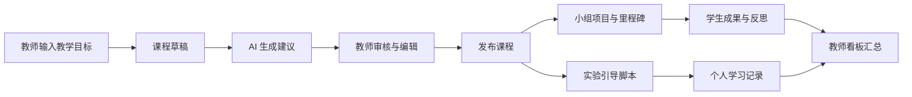

# 课程工作台与小组项目设计

## 目标

在现有课堂实训平台中建立教师可审核的课程草稿、小组项目任务和受控实验引导闭环。教师从教学目标创建草稿，审核并发布课程任务；学生完成个人实验和小组里程碑；教师在现有看板查看进度与评价。

## 范围

第一版包含四项能力：

1. 教师端课程草稿工作台。草稿保存教学目标、目标班级、课程标题、简介、实验引导、作业建议和项目任务；AI 可生成草稿内容，但不能直接发布。
2. 受控实验引导脚本。脚本由顺序步骤组成，动作仅允许高亮部件、切换 X-ray、显示提示和等待现有挑战完成。客户端只解释白名单动作。
3. 小组项目任务。教师为已发布课程建立小组、分配学生与角色、设置里程碑和交付说明；学生提交文本反思和链接/附件说明；教师可评语和评价。
4. 教师看板汇总。课程、小组、成员和里程碑状态在现有教师端中可查看，并与现有个人学习记录并列呈现。

第一版不包含实时多智能体对话、语音识别/合成、PPT 导入、自动分组算法、文件二进制上传和跨班级协作。

## 领域模型

### CourseDraft

`course_drafts` 由教师拥有，字段包括 `id`、`teacher_id`、`class_id`、`title`、`summary`、`learning_objectives_json`、`guide_script_json`、`assignment_outline_json`、`project_outline_json`、`status`、`created_at`、`updated_at`、`published_at`。

状态仅允许 `draft -> published`。发布后草稿内容冻结；教师需要修改时新建草稿版本，避免已参与学生的任务定义变化。

### Guide script

每一步是 `{ id, title, instruction, action, completion }`。

- `action` 只能是 `highlightPart`、`setXray`、`showHint` 或 `none`。
- `completion` 只能是 `acknowledge` 或 `challengeComplete`。
- `highlightPart` 的部件 ID 必须存在于电脑组成场景的部件清单。
- `setXray` 只有布尔值。

服务端验证并持久化脚本，客户端不得执行脚本以外的操作。

### TeamProject

发布的草稿可生成一个项目任务。`team_projects` 保存课程、班级、标题、说明与里程碑定义；`project_teams` 保存小组；`project_team_members` 保存成员与角色；`project_milestone_submissions` 保存每位学生对每个里程碑的文本成果、链接说明、提交时间、教师评语与状态。

教师是唯一可创建小组、变更成员、设置里程碑和评价的人。学生只能查看自己班级、自己小组和自己的提交内容。

## 数据流

AI 生成失败时，草稿仍保留教师已输入的目标并提示使用手动模板。生成接口不得接收学生答案、会话 Cookie 或任何密钥；生成结果必须通过同一套课程草稿校验器。

## 前端结构

教师看板新增“课程工作台”页签，分为草稿列表、草稿编辑器、发布确认和项目分组区。现有作业区域继续独立运行；发布工作台后，教师可从草稿中的作业建议手动创建或复用作业。

学生端在课程首页显示已发布项目。项目页展示小组、个人角色、里程碑、团队提交状态、自己的提交表单和教师反馈。实验页中的课程引导是可关闭的侧栏，不修改既有实验判定。

## 安全与可靠性

- 所有教师资源查询以认证用户和路由 ID 鉴权，忽略请求体中的教师、班级和学生 ID。
- 发布、分组、成员变更、评价及提交均记录审计事件。
- 服务端校验课程草稿、引导动作、里程碑与状态转换；客户端输入不得决定完成分数。
- 对有副作用的请求不自动重试；提交结果采用现有幂等策略或新增提交 ID。

## 验收

1. 教师能创建草稿、生成或手动编辑内容、保存、发布，且不能发布无标题、无目标或无里程碑的项目草稿。
2. 学生只能读取已发布且属于本人班级的课程和项目。
3. 引导脚本能在 3D 概述中高亮部件、开关 X-ray、显示提示，并在完成步骤后记录参与证据。
4. 教师能创建小组、分配成员与角色；学生能提交自己的里程碑反思；教师能评价；看板正确显示团队和个人进度。
5. 覆盖越权、非法动作、非法状态转换、重复提交和 AI 失败降级的服务端测试；补齐教师和学生浏览器闭环测试。
