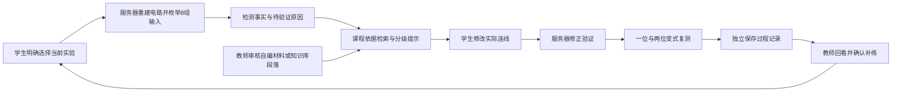

# 芯游记：实验证据诊断与补救学习首期

## 参赛主线

学生提交实际电路片段，服务器定位可验证的失败反例；助教结合课程依据提供分级帮助；学生修正并完成变式复测；教师审核材料、发布补练并回看过程。

首期为第三章全加器，支持固定连线与等价自由拼装。当前交付不表示其他章节已支持该流程，也不代表已取得真实课堂教学效果。



## 使用入口

### 学生

1. 课程首页选择第三章全加器；地图侧栏的教师补练也进入同一实验。
2. 在实验台下方“小芯实验诊断与补练”选择所属班级/教师任务，点击诊断。
3. 查看服务器检测统计和反例，按需展开概念、定位、操作和主动请求的参考解法四级提示。
4. 修改工作台连线，点击“验证当前修改”；通过后开始四道变式复测。
5. 复测判分在账号单独保存，刷新可恢复。关联的教师任务只在复测通过时完成。正式实验仍需原“提交检测”，解锁和课堂规则保留。

桌面用于操作固定电路。手机可阅读保存的诊断和继续已开始的复测；不把手机上的固定电路替代提示当作可操作画布。

### 教师

1. 学习记录 → 选择本人班级 → 全班概览 → 实验诊断与补练回看。
2. 阅读课程依据并确认审核发布；也可以选取自己知识库里的课程段落，明确确认后发布到本班。
3. 根据“待修正、待复测、正在复测、复测未通过”的最近诊断人数选择补练对象，或手动选择学生；核对标题并发布。已有待完成任务不会重复创建。
4. 刷新查看诊断、提示层级、复测与任务完成情况；通过“过程证据”回看最近十次本班诊断。
5. CSV 导出本班记录，复测耗时是服务器墙钟时长，包含停留和中断，不等于专注学习时间。

教师试练保存到教师本人账号，不计入学生课堂统计。只有本人班级当前成员的相应班级诊断可以被回看。

## 智能体实现与限制

- `inspect_circuit`：服务器校验实际节点/端口/连线，枚举8组输入，区分进位、求和、公共结构或迁移验证方向。浏览器提供的通过/成绩不作为依据。
- `lookup_course_sources`：受控来源目录检索，包含三条平台自编依据和教师从知识库发布的段落副本，保留出处、版本及审核状态。这是首期有限课程语料，不声称完成全课程向量 RAG。
- `propose_remediation`：配置 DeepSeek 且用户明确选择后，模型先选取课程依据，再按工具返回的段落安排概念级补救建议。服务器限制工具顺序、引用、内容长度和工具种类；模型不能判分、发布任务或改成绩。
- 最多两次模型请求，每次最多8秒；失败/超时/非法工具/无效引用转为本地流程并标示来源。正常 JSON 和合法引用只说明协议通过校验，不证明每句生成文字语义正确；仍需教师评测。
- 提示由受控本地课程逻辑逐级返回，不自动展开完整参考答案。新提示与修正验证留痕，旧提示保留当时的内容。
- 变式题在服务器生成，服务器按实际输入和位宽计算答案。第一次诊断、修正和历次复测结果分别保留，不能凭浏览器提交的分数冒充通过。
- 复测期间未请求新提示只是系统可观察行为，不意味着学生完全独立、不曾查看其他资料或已经掌握。

### 数据发送边界

默认只做本地诊断。勾选 DeepSeek 工具助教后，仅发送此次服务器复算的统计、错误方向、一个失败输入及实际/预期输出，并读取有限课程依据。身份、历史成绩、教师反馈、原始自定义节点标签、坐标和完整连线不发送。传统主动问答边界继续保留。

发布知识库段落需要教师确认教学内容和使用范围。删除原知识库文件不会自动删除已经确认发布的材料副本。

## 验证命令

```powershell
node --test server/learningCoach.test.mjs server/learningCoachRoutes.test.mjs
npm run qa:learning-coach
npm run eval:learning-coach
node scripts/verify-build-budget.mjs
```

可选真实 AI 协议检查：配置现有 DeepSeek 环境后运行 `node scripts/evaluate-learning-coach.mjs --live-ai`。只使用公开合成电路，不读取学生数据库。

产物位于 gitignored `prototype/qa-artifacts/learning-coach-*`：生产浏览器截图、合成案例、技术评测、公开案例的模型工具轨迹，以及验收账号的 CSV。它们是工程验证材料，不作为真实课堂证据。

## 真实课堂试用与参赛材料

1. 选择一班、两个教学活动，使用正式账号；由教师审核课程依据和约50条真实问题/错误案例，记录标准诊断、允许的提示、出处和争议项。
2. 对照当前答疑、课程依据答疑和实验工具流程；保留独立测试案例，核查诊断正确率、引用是否真正支持讲解、提前给答案和非法工具调用。
3. 课堂记录首次独立完成、提示使用、变式通过、再次出现的同类错误；额外记录教师检查与讲评时间、学生反馈。当前 CSV 支持过程计数，教师工时与问卷需现场采集。
4. 说明人数、课程背景、缺失样本和分组条件。少量试用可以证明流程可用，不能直接宣称因果性教学提升。
5. 三分钟演示建议：30秒真实痛点与任务 → 50秒错误反例和分级提示 → 40秒修改验证与变式题 → 40秒教师审核/补练/回看 → 20秒技术轨迹与实测边界。正式演示应选用已获准展示的记录。

## 工程证据

- 已完成一轮生产浏览器流程：教师来源发布和补练、学生真实连线诊断/修正、手机复测、刷新恢复、任务完成、CSV 和错误重试。
- 已用公开全加器案例完成一次真实 DeepSeek 两步工具协议检查。
- 50个合成断线案例用于技术回归；标签按电路分支归属构造，不是教师审核金标准。不得把其50/50结果写成“真实学生诊断准确率100%”。
- 最终测试与构建结果见实施计划中的验收记录。

超星参考研究与参赛取舍见 [学习超星](chaoxing-competition-study-2026-10-05.md)。
